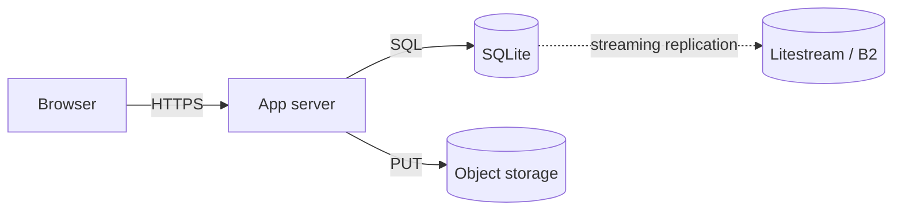

# Section catalog

Every section a design doc can carry: what it's for, the questions it answers, when to include it, and a short example. `SKILL.md` has the trigger table — this file has the substance.

Sections appear here in recommended document order.

---

## Always included

### Title

**Purpose:** Name the project so people can refer to it.

**Answers:** What is this called?

**Guidance:** Short, distinctive, evocative. A name people can say in a meeting without qualifying it.

> **Little Moments: private photo sharing for families**

---

### Metadata

**Purpose:** Establish who owns the doc, how current it is, and where it lives.

**Answers:** Who wrote this? When? Is it still being edited or is it settled? Where's the canonical copy?

**Guidance:** Keep it to four or five key-value lines at the very top. Status is the field readers actually scan for — make it unambiguous ("Draft", "In review", "Design-complete, ready for implementation", "Approved"). Add Reviewers and Approvers only when the doc needs formal signoff.

> **Author:** Michael Lynch (michael@mtlynch.io)
> **Status:** Design-complete, ready for implementation
> **Created:** 2026-03-06
> **URL:** https://codeberg.org/mtlynch/little-moments

---

### Objective

**Purpose:** State what the project accomplishes, in one sentence, for someone who knows nothing about it.

**Answers:** What is this project going to do?

**Guidance:** One or two sentences. No jargon, no acronyms, no dependencies on having read anything else. This is the single most re-read line in the doc.

> Create a web app that allows parents to share photos and videos of their children with close friends and family members.

---

### Background

**Purpose:** Give the reader the context the author already has.

**Answers:** Why are we doing this? What problem exists today? What's been tried? What changed to make this worth doing now?

**Guidance:** Two to four paragraphs. Concrete beats abstract — name the actual product, the actual limitation, the actual incident. This section plus the Objective must carry a partner-team reader on their own.

> We currently use TinyBeans, a commercial photo-sharing service. I find it gross that a service for sharing baby photos injects ads into my family photos and collects ad-targeting information about my friends and family, especially when I pay for my usage.

---

### Goals

**Purpose:** Define what success looks like.

**Answers:** How will we know this worked?

**Guidance:** Bulleted. Each goal states impact on users, the team, or the company — **never** an implementation detail. Measurable where possible.

> - Increase user-perceived responsiveness for the Trogdor web app
> - Reduce database server load
> - Keep photo and video size limits high enough that parents perceive storage as essentially unlimited

Rewrite implementation-shaped goals into the outcome they serve:

| Implementation-shaped | Outcome |
|---|---|
| Add Kubernetes to our infrastructure | Minimize outages related to deploying new app versions |
| Migrate to Postgres | Support reporting queries without degrading write throughput |
| Rewrite the parser in Rust | Cut p99 ingest latency below one second |

---

### Non-goals

**Purpose:** Fence the scope so reviewers stop proposing things you've already decided against.

**Answers:** What is deliberately out of scope?

**Guidance:** Bulleted, short. Distinguish "not now" from "not ever" — they invite very different feedback. A non-goal is a decision, not an oversight, so say why in a clause if it isn't obvious.

> - Not building a mobile app in v1 — the responsive web app covers the primary use case
> - Not supporting public/unlisted albums, ever — the entire premise is private sharing

---

## Conditional sections

### Related Documents

**Trigger:** Prior specs, designs, test plans, or postmortems exist.

**Purpose:** Connect this doc to the material around it.

**Answers:** What else should I read? What does this supersede?

> - [Ingest pipeline v1 design](../design/ingest-v1.md) — superseded by this doc
> - [Postmortem: 2026-04 duplicate-delivery incident](../postmortems/2026-04-dupes.md) — motivates the idempotency requirement

---

### Scenarios

**Trigger:** User- or system-facing workflows aren't obvious from the Goals alone.

**Purpose:** Show the design in motion.

**Answers:** How will someone actually use this, step by step?

**Guidance:** Numbered workflows, four to seven steps each. Write them as concrete narratives with a named actor, not abstract capability statements.

> **Scenario 2: Grandparent views a new album**
> 1. Nana receives an email notification that Chris posted 12 new photos
> 2. She clicks the link and lands on the album without logging in — her email carries a signed token
> 3. She scrolls the album; images lazy-load at screen resolution
> 4. She taps a photo to see it full-size and leaves a comment
> 5. Chris receives a notification of her comment

---

### Diagrams

**Trigger:** Multiple components, non-obvious data flow, or a protocol.

**Purpose:** Give reviewers the mental picture the author already has.

**Answers:** What talks to what? Where does data flow? What are the trust boundaries?

**Guidance:** Emit **Mermaid or D2 source** in a fenced block — never an image, never a link to one. Show data flow, component relationships, interaction with dependencies and downstream clients, and protocols. Expect diagrams to attract a large share of the review feedback; that's the point of including them.

````

````

---

### Glossary

**Trigger:** Internal jargon that genuinely can't be defined inline.

**Purpose:** Let outsiders read the doc.

**Answers:** What does this term mean here?

**Guidance:** Prefer defining a term at first use in the prose. Reach for a glossary only when the same handful of terms recur throughout and inline definitions would clutter every paragraph.

> **Subscriber** — a person invited to view an album; cannot upload
> **Owner** — the account that created an album; can upload, invite, and delete

---

### Constraints

**Trigger:** Something real is imposed from outside — budget, infrastructure, contract, deadline, mandated dependency.

**Purpose:** Explain why obvious options are off the table.

**Answers:** What can't we change? What are we stuck with?

**Guidance:** Only genuine external constraints. A preference is not a constraint; if you chose it, it belongs in Alternatives Considered instead.

> - Must run on the existing single-VPS deployment — no budget for managed Kubernetes
> - Must retain audit records for seven years per the customer contract

---

### Service Level Objectives (SLOs)

**Trigger:** Production availability, latency, or scale requirements exist.

**Purpose:** Make "fast enough" and "reliable enough" into numbers.

**Answers:** How much uptime? How fast? At what scale?

**Guidance:** Split into Uptime, Latency, and Scale. Real numbers, or omit the section — an SLO without a number is decoration.

> **Uptime:** 99.5% monthly, excluding announced maintenance
> **Latency:** album page renders in under 800 ms at p95 on a 4G connection
> **Scale:** 500 families, 50 GB media per family, 10 concurrent uploads

---

### Monitoring / Alerting

**Trigger:** The SLO trigger fired — a service someone is on call for.

**Purpose:** Say how you'll know it's broken before users tell you.

**Answers:** What do we measure? What pages a human? What just gets logged?

**Guidance:** Tie each alert back to an SLO. An alert that maps to no objective is noise that will eventually be muted.

> - Page on uptime check failing 3 consecutive minutes (maps to the uptime SLO)
> - Page on p95 album render exceeding 2 s for 10 minutes (maps to the latency SLO)
> - Ticket, don't page, on backup replication lag over 1 hour

---

### Timeline

**Trigger:** Multiple people coordinate, or milestones are externally committed.

**Purpose:** Sequence the work and expose dependencies between people.

**Answers:** What lands when? What blocks what?

**Guidance:** Milestones with the features each delivers. Keep it coarse — this is a design doc, not a project plan, and a schedule specified to the day will be wrong within a week.

> **M1 — Auth and album CRUD** (2 weeks)
> **M2 — Upload and transcode pipeline** (3 weeks, blocked on M1)
> **M3 — Notifications and invites** (2 weeks)

---

### Interfaces

**Trigger:** An API, UI, file format, or protocol that others will code against.

**Purpose:** Fix the contract, because contracts are expensive to change once anyone depends on them.

**Answers:** What are the endpoints, the payloads, the error semantics, the screens?

**Guidance:** Boundaries and semantics, not implementation. Include the shape of a request and response and what the error cases are; leave handler internals out. This is the section most at risk of becoming the implementation — see hard rule 6.

> `POST /api/albums/{id}/media` — multipart upload, max 200 MB per file.
> Returns `202 Accepted` with a job ID; transcoding is asynchronous.
> `409 Conflict` if the content hash already exists in the album (idempotent re-upload).

---

### Dependencies / Infrastructure

**Trigger:** The design picks a language, storage, hosting, or third-party service.

**Purpose:** Record the choices that are hardest to reverse.

**Answers:** What are we building on? What are we now coupled to?

**Guidance:** State the choice and a one-line rationale. Full comparisons belong in Alternatives Considered.

> - **Language:** Go — single static binary, matches the team's existing services
> - **Database:** SQLite with Litestream replication — no separate DB server to operate at this scale
> - **Object storage:** Backblaze B2 — S3-compatible, roughly a fifth of the egress cost

---

### Security

**Trigger:** There's an attack surface or a trust boundary.

**Purpose:** Show that the threats were considered at design time, when they're cheap to prevent.

**Answers:** What's the attack surface? Who's trusted? What specifically could an attacker do?

**Guidance:** Structure as attack surface, then authentication/authorization, then enumerated threats. Give each threat a scenario and its mitigation. Vague assurances ("we'll sanitize inputs") are worth nothing here.

> **Threat: invite link leaks to a third party**
> An album invite token is forwarded outside the family.
> *Mitigation:* tokens are per-recipient, revocable from the album settings, and expire 90 days after last use.

---

### Privacy

**Trigger:** User or otherwise sensitive data is handled.

**Purpose:** Say what you collect, how long you keep it, and who can see it.

**Answers:** What data? Retained how long? Accessible to whom? Protected how?

> Exif metadata — including GPS coordinates — is stripped from every upload before storage. The original is discarded, not archived.

---

### Legal

**Trigger:** Regulated domain, contractual constraints, or an open-source licensing choice.

**Purpose:** Surface the constraints that are most expensive to discover late.

**Answers:** What regime applies? What licence, and why?

> Licensed PolyForm-Noncommercial: the source stays readable and forkable for personal use, while preventing a competitor from reselling the service.

---

### Logging

**Trigger:** A long-lived service whose failures must be debuggable after the fact.

**Purpose:** Ensure the system can be diagnosed in production.

**Answers:** What events are recorded? At what level? Retained how long? Are they scrubbed of personal data?

> Structured JSON to stdout. Request logs at INFO with user ID but never email; upload failures at ERROR with the content hash. 30-day retention.

---

### Open Issues

**Trigger:** Any decision is genuinely unresolved — expect this on most first drafts.

**Purpose:** Make uncertainty visible and assignable instead of hiding it behind confident prose.

**Answers:** What's still undecided? What are the options? What happens next?

**Guidance:** Each entry gets the problem, the visible options, and a concrete next step with an owner. When a review thread runs past two or three exchanges, drain it into an entry here. "None" is a legitimate value once everything is settled.

> **Video transcoding target**
> *Problem:* Source videos vary from 480p phone clips to 4K. Storing originals is expensive; transcoding everything to one profile degrades the good ones.
> *Options:* (a) single 1080p H.264 profile, (b) adaptive ladder at 480/720/1080, (c) store original plus one 720p proxy.
> *Next step:* Chris to measure storage cost of (c) against a month of real uploads by 2026-04-12.

---

### Resolved Issues

**Trigger:** Anything has moved out of Open Issues.

**Purpose:** Preserve why a decision went the way it did, for the person who asks in a year.

**Answers:** What did we decide, and on what basis?

**Guidance:** Keep the original problem statement and options — don't collapse the entry to its answer. Append the decision, the criteria, and who decided. This is a decision record, not a deletion.

> **SMTP vendor**
> *Problem:* Need transactional email for invites and notifications.
> *Criteria:* under $10/month at expected volume, no per-domain setup fee, EU data residency.
> *Candidates:* Postmark (best deliverability, no EU residency), Mailgun (EU region, pricier), SES (cheapest, worst onboarding).
> *Decision:* Mailgun EU, chosen 2026-03-20 by Chris. Residency outweighed the cost delta at this volume.

---

### Alternatives Considered

**Trigger:** A reader would reasonably ask "why not X?"

**Purpose:** Pre-empt the obvious objection and prove the space was actually explored.

**Answers:** What else could we have done, and why didn't we?

**Guidance:** Name the genuinely plausible alternatives, not strawmen. State what each would have been good at before saying why it lost — an alternatives section where every option is obviously terrible reads as justification rather than analysis.

> **Postgres instead of SQLite.** Better concurrent-write throughput and mature tooling for the reporting queries we may want later. Rejected because it adds a server to operate for a workload that peaks around 10 concurrent writers, and Litestream already covers the durability requirement.
