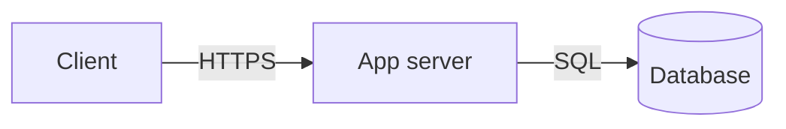

# <Short, distinctive, evocative project name>

**Author:** <name> (<email>)
**Status:** Draft <!-- Draft | In review | Design-complete, ready for implementation | Approved -->
**Created:** <YYYY-MM-DD>
**URL:** <canonical link to this doc>
<!-- Add Reviewers / Approvers only when the doc needs formal signoff. -->

## Objective

<One or two sentences. No jargon, no acronyms, no dependency on anything below.
A partner-team engineer should understand what this project does from this line alone.>

## Background

<Two to four paragraphs. Why now? What's broken or missing today? What's been
tried? Name the actual product, limitation, or incident — concrete beats abstract.

This section plus the Objective must carry a reader who has never spoken to you.>

## Goals

<Impact on users, the team, or the company. Never implementation.
"Minimize outages when deploying new versions", not "Add Kubernetes".>

- <Goal>
- <Goal>

## Non-goals

<What's deliberately excluded. Distinguish "not now" from "not ever" —
they invite very different feedback.>

- <Non-goal>
- <Non-goal>

<!-- ─────────────────────────────────────────────────────────────────────────
     CONDITIONAL SECTIONS

     Everything below fires only on its trigger. Delete what doesn't apply;
     uncomment what does. Full guidance and worked examples for each section
     are in references/sections.md.
     ───────────────────────────────────────────────────────────────────────── -->

<!-- ## Related documents
     TRIGGER: prior specs, designs, test plans, or postmortems exist.

- [<title>](<path>) — <how it relates; note if this doc supersedes it>
-->

<!-- ## Scenarios
     TRIGGER: user- or system-facing workflows aren't obvious from the Goals.
     Numbered narratives with a named actor, 4–7 steps each.

### Scenario 1: <name>
1. <step>
2. <step>
-->

<!-- ## Diagrams
     TRIGGER: multiple components, non-obvious data flow, or a protocol.
     Mermaid or D2 SOURCE only — never an image, never a link to one.

-->

<!-- ## Glossary
     TRIGGER: internal jargon that genuinely can't be defined inline.
     Prefer defining terms at first use; use this only when they recur throughout.

- **<term>** — <definition>
-->

<!-- ## Constraints
     TRIGGER: something real is imposed from OUTSIDE — budget, infrastructure,
     contract, deadline, mandated dependency. A preference you chose is not a
     constraint; it belongs in Alternatives considered.

- <constraint>
-->

<!-- ## Service level objectives (SLOs)
     TRIGGER: production availability, latency, or scale requirements exist.
     Real numbers, or omit the section entirely.

**Uptime:** <target, and what's excluded>
**Latency:** <operation> under <N ms> at <percentile>
**Scale:** <users / volume / concurrency>
-->

<!-- ## Monitoring and alerting
     TRIGGER: the SLO trigger fired — a service someone is on call for.
     Tie every alert to an SLO; an alert mapping to no objective becomes noise.

- Page on <condition> (maps to the <X> SLO)
- Ticket, don't page, on <condition>
-->

<!-- ## Timeline
     TRIGGER: multiple people coordinate, or milestones are externally committed.
     Coarse milestones — this is a design doc, not a project plan.

**M1 — <deliverable>** (<duration>)
**M2 — <deliverable>** (<duration>, blocked on M1)
-->

<!-- ## Interfaces
     TRIGGER: an API, UI, file format, or protocol others will code against.
     Boundaries and semantics, including error cases. NOT handler internals.

`<METHOD> <path>` — <purpose>
Returns <status> with <shape>. <Error case> returns <status>.
-->

<!-- ## Dependencies and infrastructure
     TRIGGER: the design picks a language, storage, hosting, or third-party service.
     Choice plus a one-line rationale; full comparisons go in Alternatives considered.

- **<Category>:** <choice> — <why>
-->

<!-- ## Security
     TRIGGER: there's an attack surface or a trust boundary.
     Enumerate real threats with scenarios. Vague assurances are worth nothing.

**Attack surface:** <what's exposed, to whom>
**Authentication:** <mechanism>

### Threat: <name>
<Scenario — what an attacker actually does.>
*Mitigation:* <specific control>
-->

<!-- ## Privacy
     TRIGGER: user or otherwise sensitive data is handled.

**Collected:** <what>
**Retention:** <how long>
**Access:** <who>
**Protection:** <how>
-->

<!-- ## Legal
     TRIGGER: regulated domain, contractual constraints, or an OSS licensing choice.

<Regime or licence, and the reasoning behind the choice.>
-->

<!-- ## Logging
     TRIGGER: a long-lived service whose failures must be debuggable after the fact.

<Format, levels, what's included, what's scrubbed, retention.>
-->

## Open issues

<Each entry: the problem, the visible options, and a concrete next step with an
owner. Where the design is genuinely unresolved, say so here — never paper over
it with confident prose elsewhere. "None" is a legitimate value once settled.>

### <Issue title>

*Problem:* <what's undecided and why it matters>
*Options:* (a) <option>, (b) <option>, (c) <option>
*Next step:* <who does what, by when>

## Resolved issues

<Moved from Open issues. Keep the original problem and options — don't collapse
the entry to its answer. Append the decision, the criteria, and who decided.>

### <Issue title>

*Problem:* <as originally stated>
*Criteria:* <what the decision was judged against>
*Candidates:* <options considered, with notes>
*Decision:* <what was chosen, by whom, on what date, and why>

<!-- ## Alternatives considered
     TRIGGER: a reader would reasonably ask "why not X?"
     Name plausible alternatives, not strawmen. Say what each would have been
     GOOD at before saying why it lost.

**<Alternative>.** <What it does well.> Rejected because <reason>.
-->
